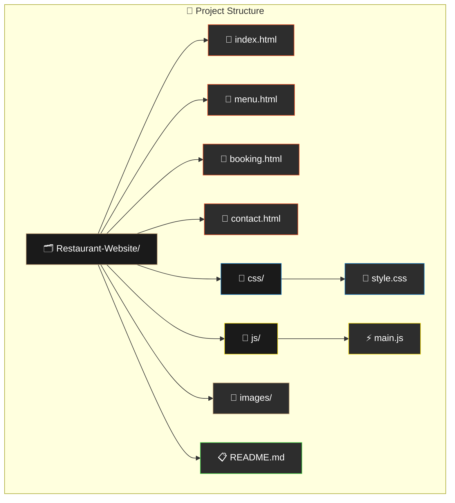
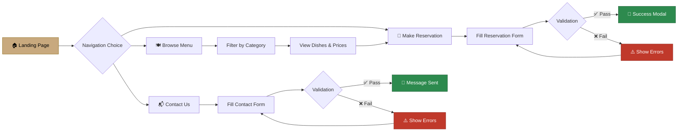
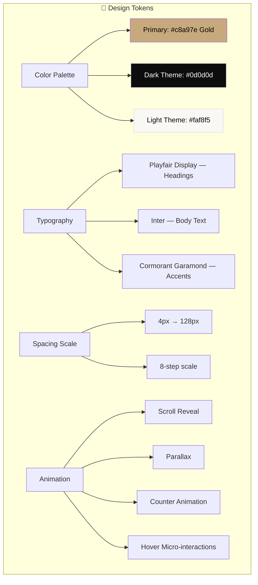

<div align="center">

<!-- Animated Header -->


<!-- Typing Animation -->


<!-- Badges Row 1 -->
[](https://developer.mozilla.org/en-US/docs/Web/HTML)
[](https://developer.mozilla.org/en-US/docs/Web/CSS)
[](https://developer.mozilla.org/en-US/docs/Web/JavaScript)
[](https://developer.mozilla.org/en-US/docs/Learn/CSS/CSS_layout/Responsive_Design)

<!-- Badges Row 2 -->


<br/>

<p><em>A premium, fully responsive restaurant website featuring an interactive menu, online reservation system, theme toggle, and stunning animations — built with pure HTML, CSS & JavaScript.</em></p>

---

</div>

## ✨ Features at a Glance

<table>
<tr>
<td width="50%">

### 🎨 Design & UI
- 🌗 **Dark / Light Theme Toggle** with persistence
- 💫 **Scroll-triggered animations** (reveal, scale, slide)
- 🖱️ **Cursor glow effect** on desktop
- 🪟 **Glassmorphism** navbar with backdrop blur
- 📱 **Fully responsive** (mobile, tablet, desktop)
- ✨ **Micro-interactions** on hover, focus, and click
- 🎭 **Page loading screen** with branded spinner
- 🎯 **Parallax scrolling** effects

</td>
<td width="50%">

### ⚙️ Functionality
- 📋 **Interactive menu** with category filters
- 📅 **Reservation form** with real-time validation
- 📧 **Contact form** with field validation & toast alerts
- 🔢 **Animated counters** for statistics
- 📰 **Newsletter subscription** with email validation
- 🍔 **Mobile hamburger menu** with overlay
- 🗺️ **Map integration** placeholder
- 📊 **Success modals** for form submissions

</td>
</tr>
</table>

---

## 📄 Pages Overview

| Page | File | Description |
|------|------|-------------|
| 🏠 **Home** | `index.html` | Hero section, features, stats, signature dishes, parallax CTA, testimonials, gallery, newsletter |
| 🍽️ **Menu** | `menu.html` | Filterable menu categories (Appetizers, Mains, Desserts, Beverages) with prices and dietary tags |
| 📅 **Reservations** | `booking.html` | Full reservation form with validation, opening hours widget, private dining rooms showcase |
| 📬 **Contact** | `contact.html` | Contact form with validation, contact info cards, interactive FAQ section, map placeholder |

---

## 🏗️ Architecture



---

## 🔄 User Flow & Interaction Workflow



---

## 🎨 Design System



---

## 🚀 Quick Start

### Prerequisites

No build tools required! This is a pure HTML/CSS/JS project.

### Installation

```bash
# Clone the repository
git clone https://github.com/your-username/Restaurant-Website-with-Menu-and-Booking.git

# Navigate to project directory
cd Restaurant-Website-with-Menu-and-Booking

# Open in your browser
# Option 1: Simply open index.html
start index.html

# Option 2: Use VS Code Live Server
code . && # Install Live Server extension → Right-click index.html → Open with Live Server

# Option 3: Use Python's built-in server
python -m http.server 8000
# Then visit http://localhost:8000
```

---

## 🗂️ Project Structure

```
Restaurant-Website-with-Menu-and-Booking/
│
├── 📄 index.html              # Home page — hero, features, gallery
├── 📄 menu.html               # Menu page — filterable dishes
├── 📄 booking.html            # Reservations — booking form
├── 📄 contact.html            # Contact — form & info
│
├── 📁 css/
│   └── 🎨 style.css           # Complete design system (~1400 lines)
│                                 ├── CSS custom properties (tokens)
│                                 ├── Light & Dark theme variables
│                                 ├── Component styles
│                                 ├── Animation keyframes
│                                 └── Responsive breakpoints
│
├── 📁 js/
│   └── ⚡ main.js              # Interactive functionality (~400 lines)
│                                 ├── Theme toggle + localStorage
│                                 ├── Scroll reveal (IntersectionObserver)
│                                 ├── Form validation engine
│                                 ├── Menu category filters
│                                 ├── Animated counters
│                                 ├── Parallax effect
│                                 ├── Mobile menu
│                                 └── Toast notifications
│
├── 📁 images/
│   ├── 🖼️ hero-bg.png          # Hero section background
│   ├── 🖼️ dish-appetizer.png   # Appetizer dish photo
│   ├── 🖼️ dish-main.png        # Main course photo
│   ├── 🖼️ dish-dessert.png     # Dessert photo
│   ├── 🖼️ interior.png         # Restaurant interior
│   └── 🖼️ chef.png             # Chef in action
│
└── 📋 README.md                # This file
```

---

## 🛠️ Technical Implementation

### CSS Architecture

| Feature | Implementation |
|---------|---------------|
| **Design Tokens** | CSS Custom Properties (`--color-*`, `--fs-*`, `--space-*`) |
| **Theme System** | `[data-theme="dark"]` attribute selector overrides |
| **Layout** | CSS Grid + Flexbox |
| **Responsive** | Mobile-first with `768px` and `1024px` breakpoints |
| **Animations** | `@keyframes` + `IntersectionObserver` trigger |
| **Glass Effect** | `backdrop-filter: blur()` with semi-transparent backgrounds |
| **Typography** | Google Fonts with `clamp()` fluid sizing |

### JavaScript Features

| Feature | API / Pattern |
|---------|---------------|
| **Scroll Reveal** | `IntersectionObserver` API |
| **Theme Persistence** | `localStorage` |
| **Form Validation** | Custom declarative engine with `data-validate` attributes |
| **Counters** | `requestAnimationFrame` with eased interpolation |
| **Parallax** | Scroll event + `getBoundingClientRect()` |
| **Toast System** | Dynamic DOM injection |
| **Mobile Menu** | CSS transform + JS toggle with overlay |
| **Cursor Glow** | `mousemove` + `requestAnimationFrame` lerping |

---

## 📱 Responsive Breakpoints

```
┌─────────────────────────────────────────────┐
│           Desktop (> 1024px)                │
│  ┌────────────────────────────────────────┐ │
│  │   3-column grids, full gallery,        │ │
│  │   side-by-side forms, cursor glow      │ │
│  └────────────────────────────────────────┘ │
├─────────────────────────────────────────────┤
│           Tablet (769px – 1024px)           │
│  ┌────────────────────────────────────────┐ │
│  │   2-column grids, adjusted gallery,    │ │
│  │   compact footer layout                │ │
│  └────────────────────────────────────────┘ │
├─────────────────────────────────────────────┤
│           Mobile (≤ 768px)                  │
│  ┌──────────────────┐                       │
│  │  Single column,  │                       │
│  │  hamburger menu, │                       │
│  │  stacked forms,  │                       │
│  │  reduced spacing │                       │
│  └──────────────────┘                       │
└─────────────────────────────────────────────┘
```

---

## 🌗 Theme Toggle

The website supports **Light** and **Dark** modes with smooth transitions:

| Element | Light Mode | Dark Mode |
|---------|-----------|-----------|
| Background | `#faf8f5` warm cream | `#0d0d0d` deep black |
| Cards | `#ffffff` | `#1e1e1e` |
| Text | `#1a1a1a` | `#f0ece4` |
| Accent | `#c8a97e` gold | `#c8a97e` gold |
| Navbar | Glass blur (white) | Glass blur (dark) |

Theme preference is saved to `localStorage` and persists across sessions.

---

## ✅ Form Validation

Both forms support real-time validation with these rules:

```javascript
// Validation Rules (declarative via data-validate attribute)
data-validate="required"          // Field cannot be empty
data-validate="required, email"   // Must be valid email
data-validate="required, phone"   // Must be valid phone number
data-validate="required, date"    // Must be a future date
data-validate="required, min:10"  // Minimum 10 characters
```

**Validation UX Flow:**
1. ⏳ Validation triggers on `blur` (first interaction)
2. 🔄 Real-time validation on `input` (after first blur)
3. ✅ Green border for valid fields
4. ❌ Red border + error message for invalid fields
5. 🎉 Success modal on valid submission

---

## 🖼️ Image Optimization

| Technique | Implementation |
|-----------|---------------|
| **Lazy Loading** | `loading="lazy"` on below-fold images |
| **Eager Loading** | `loading="eager"` on hero/header images |
| **Dimensions** | Explicit `width`/`height` to prevent CLS |
| **Alt Text** | Descriptive `alt` attributes on all images |
| **Object Fit** | `object-fit: cover` for consistent aspect ratios |

---

## 🤝 Contributing

Contributions are welcome! Here's how:

```bash
# 1. Fork the repository
# 2. Create your feature branch
git checkout -b feature/amazing-feature

# 3. Commit your changes
git commit -m "feat: add amazing feature"

# 4. Push to the branch
git push origin feature/amazing-feature

# 5. Open a Pull Request
```

---

## 📜 License

This project is licensed under the MIT License — see the [LICENSE](LICENSE) file for details.

---

<div align="center">


<br/>

**Made with ❤️ and ☕**

</div>
